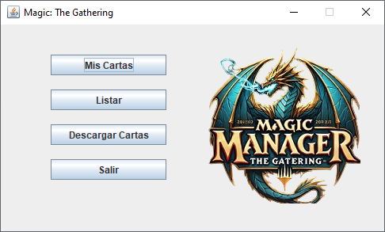
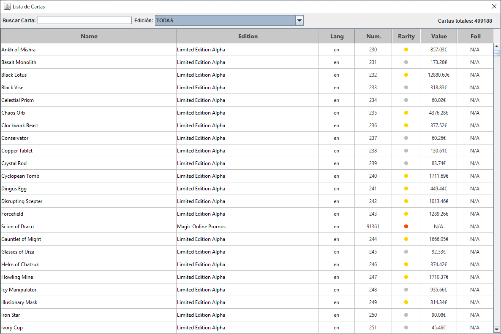
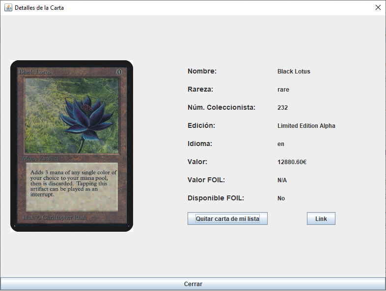
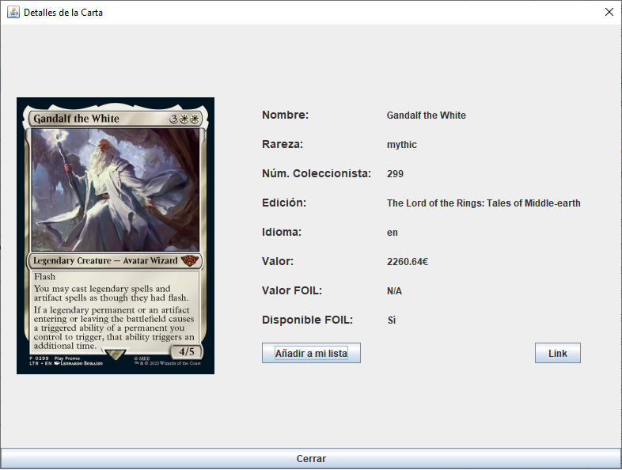
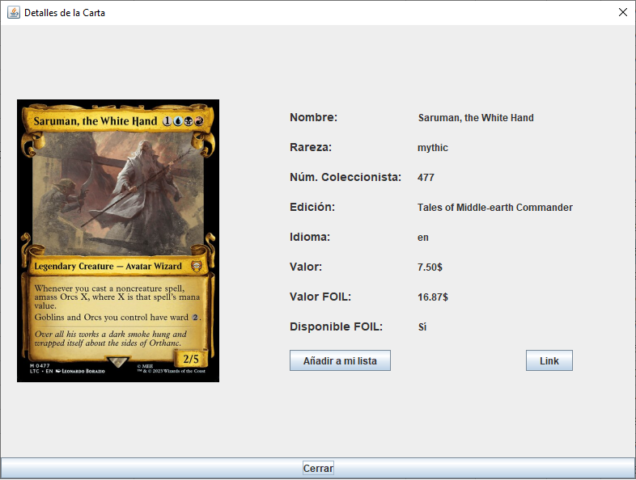

# 🚀 Magic Card Manager

Magic Card Manager es una aplicación Java diseñada para gestionar, organizar y visualizar cartas del popular juego Magic: The Gathering.
Este es mi primer proyecto personal complejo, desarrollado completamente desde cero como parte de mi aprendizaje como programador.
## 🎯 Objetivos del proyecto

- Profundizar en Java, interfaces gráficas con Swing y manejo avanzado de datos.
- Integrar y consumir datos desde una API REST externa.
- Implementar almacenamiento local de información en formato JSON.

## 🛠️ Funciones Principales

- **Búsqueda avanzada de cartas:** Permite búsquedas por nombre y edición, además de ordenar resultados por nombre, edición, idioma, número de coleccionista, rareza y precio.
- **Gestión personalizada:** Crea, modifica y administra tu lista de cartas de forma sencilla.
- **Visualización detallada:** Acceso a información completa de cada carta, incluyendo imágenes.
- **Actualizaciones automáticas:** La información de las cartas se actualiza automáticamente desde una API oficial mediante REST.

## 💻 Tecnologías empleadas

- **Lenguaje:** Java
- **Interfaz Gráfica:** Java Swing
- **Gestión de dependencias:** Maven
- **Integración API REST:** Consumo y actualización dinámica de información externa.
- **Almacenamiento:** Gestión local de datos utilizando JSON.

📸 Capturas de pantalla

- Menú Principal
  

- Menú Principal
  

- Búsqueda de Cartas
  
  

- Detalle de Carta
  
  
  

---

## 📫 Contacto
Estoy abierto a sugerencias o comentarios para mejorar el proyecto. Puedes contactarme en:  
- [LinkedIn]([https://www.linkedin.com/in/tu-perfil](https://www.linkedin.com/in/carlos-r-335390276/)
