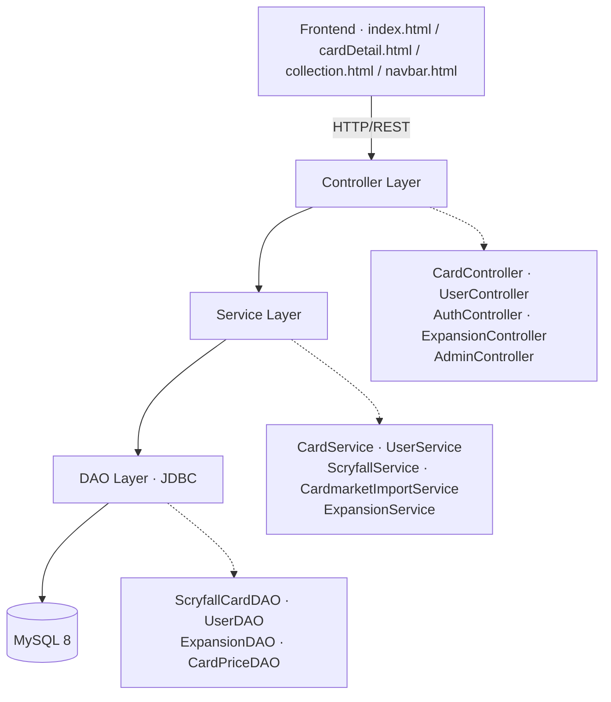
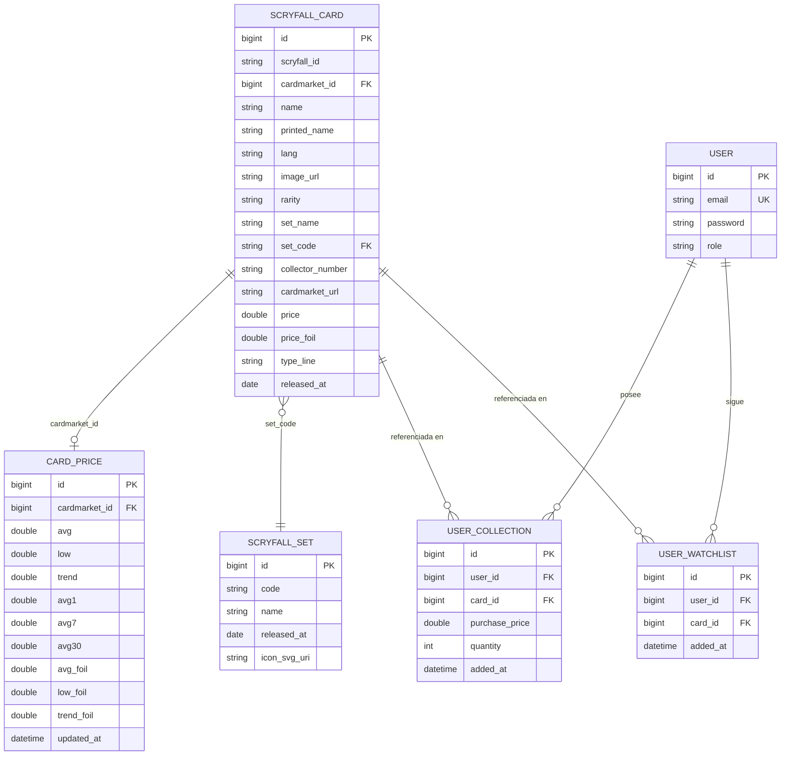

<div align="center">

# Magic Investor

**Aplicación web full stack para la búsqueda, análisis y seguimiento de inversiones en cartas de Magic: The Gathering**

[](https://www.oracle.com/java/)
[](https://spring.io/projects/spring-boot)
[](https://www.mysql.com/)
[](https://jwt.io/)

[Descripción](#descripción) •
[Tecnologías](#tecnologías) •
[Arquitectura](#arquitectura) •
[Instalación](#instalación-y-ejecución) •
[Documentación técnica](docs/DOCUMENTACION_TECNICA.md)

</div>

---

## Tabla de contenidos

- [Descripción](#descripción)
- [Tecnologías](#tecnologías)
- [Arquitectura](#arquitectura)
- [Base de datos](#base-de-datos)
- [API REST](#api-rest)
- [Seguridad](#seguridad)
- [Frontend](#frontend)
- [Instalación y ejecución](#instalación-y-ejecución)
- [Funcionalidades](#funcionalidades)

---

## Descripción

**Magic Investor** es una herramienta orientada a inversores y coleccionistas de *Magic: The Gathering*. Integra datos de **Scryfall** (catálogo de cartas) y **Cardmarket** (precios de mercado) para ofrecer una experiencia completa de búsqueda, filtrado y seguimiento de valor de cartas.

El sistema permite:

- Buscar cartas con múltiples filtros simultáneos
- Consultar precios históricos y tendencias de mercado
- Gestionar una colección personal con seguimiento de inversión
- Mantener una watchlist de cartas de interés
- Actualización automática diaria de precios

> Detalle de arquitectura, modelo de datos y decisiones técnicas: **[Documentación técnica](docs/DOCUMENTACION_TECNICA.md)**

---

## Tecnologías

<table>
<tr><td valign="top">

**Backend**

| Tecnología | Versión | Uso |
|---|---|---|
| Java | 21 | Lenguaje principal |
| Spring Boot | 3.x | Framework REST |
| Spring Security | 3.x | Autenticación y autorización |
| JJWT | 0.12.6 | Generación/validación de JWT |
| MySQL | 8.x | Base de datos relacional |
| JDBC | — | Acceso a datos (DAO manual) |
| Jackson | 2.x | Parseo de JSON en streaming |
| Lombok | — | Reducción de boilerplate |
| Maven | — | Gestión de dependencias |

</td><td valign="top">

**Frontend**

| Tecnología | Uso |
|---|---|
| HTML5 / CSS3 | Estructura y estilos |
| JavaScript ES6+ | Lógica e interactividad |
| Módulos ES6 | Organización del código |
| noUiSlider | Slider de rango de precio |
| Google Fonts (Cinzel + Crimson Pro) | Tipografía premium |

**APIs externas**

| API | Uso |
|---|---|
| Scryfall Bulk Data | Catálogo completo de cartas |
| Scryfall Sets API | Información de ediciones |
| Cardmarket Price Guide | Precios diarios de mercado |

</td></tr>
</table>

---

## Arquitectura

Arquitectura en capas clásica de Spring Boot, con acceso a datos manual vía JDBC para las búsquedas:


```mermaid
flowchart TD
    A[Frontend · index.html / cardDetail.html / collection.html / navbar.html] -- HTTP/REST --> B[Controller Layer]
    B --> C[Service Layer]
    C --> D[DAO Layer · JDBC]
    D --> E[(MySQL 8)]

    B1["CardController · UserController<br/>AuthController · ExpansionController<br/>AdminController"]
    C1["CardService · UserService<br/>ScryfallService · CardmarketImportService<br/>ExpansionService"]
    D1["ScryfallCardDAO · UserDAO<br/>ExpansionDAO · CardPriceDAO"]

    B -.-> B1
    C -.-> C1
    D -.-> D1
```

### Decisiones de diseño

- **DAO manual con JDBC** en lugar de JPA para queries complejas y dinámicas con múltiples filtros opcionales. Permite construcción de queries con `StringBuilder` e índices optimizados.
- **JWT stateless** para autenticación sin sesiones en servidor, ideal para APIs REST.
- **Parseo en streaming con Jackson** para procesar los JSON de Scryfall (~500 MB) sin cargarlos en memoria.
- **Queries dinámicas con `WHERE 1=1`** para combinar filtros opcionales de forma limpia y segura con `PreparedStatement`.

---

## Base de datos

### Diagrama entidad-relación


```mermaid
erDiagram
    SCRYFALL_CARD ||--o| CARD_PRICE : "cardmarket_id"
    SCRYFALL_CARD }o--|| SCRYFALL_SET : "set_code"
    USER ||--o{ USER_COLLECTION : "posee"
    USER ||--o{ USER_WATCHLIST : "sigue"
    SCRYFALL_CARD ||--o{ USER_COLLECTION : "referenciada en"
    SCRYFALL_CARD ||--o{ USER_WATCHLIST : "referenciada en"

    SCRYFALL_CARD {
        bigint id PK
        string scryfall_id
        bigint cardmarket_id FK
        string name
        string printed_name
        string lang
        string image_url
        string rarity
        string set_name
        string set_code FK
        string collector_number
        string cardmarket_url
        double price
        double price_foil
        string type_line
        date released_at
    }

    CARD_PRICE {
        bigint id PK
        bigint cardmarket_id FK
        double avg
        double low
        double trend
        double avg1
        double avg7
        double avg30
        double avg_foil
        double low_foil
        double trend_foil
        datetime updated_at
    }

    SCRYFALL_SET {
        bigint id PK
        string code
        string name
        date released_at
        string icon_svg_uri
    }

    USER {
        bigint id PK
        string email UK
        string password
        string role
    }

    USER_COLLECTION {
        bigint id PK
        bigint user_id FK
        bigint card_id FK
        double purchase_price
        int quantity
        datetime added_at
    }

    USER_WATCHLIST {
        bigint id PK
        bigint user_id FK
        bigint card_id FK
        datetime added_at
    }
```

### Índices relevantes en `scryfall_card`

```sql
INDEX idx_name (name)
INDEX idx_printed_name (printed_name)
INDEX idx_rarity (rarity)
INDEX idx_lang (lang)
INDEX idx_set_name (set_name)
INDEX idx_set_code (set_code)
INDEX idx_type_line (type_line)
INDEX idx_price (price)
INDEX idx_cardmarket (cardmarket_id)
```

---

## API REST

### Autenticación — `/auth`

| Método | Endpoint | Descripción | Auth |
|---|---|---|---|
| POST | `/auth/register` | Registrar nuevo usuario | No |
| POST | `/auth/login` | Login — devuelve JWT | No |

### Cartas — `/cards`

| Método | Endpoint | Descripción | Auth |
|---|---|---|---|
| GET | `/cards/search` | Búsqueda con filtros | No |
| GET | `/cards/id` | Detalle de carta por ID | No |

**Parámetros de búsqueda:**

| Parámetro | Tipo | Descripción |
|---|---|---|
| `name` | String | Nombre (parcial, opcional) |
| `setCode` | String | Código de edición |
| `rarity` | String | common / uncommon / rare / mythic |
| `lang` | String | Código de idioma (en, es, fr...) |
| `typeLine` | String | Tipo de carta |
| `minPrice` | Double | Precio mínimo |
| `maxPrice` | Double | Precio máximo |
| `orderBy` | String | price_asc / price_desc / name_asc / name_desc |
| `hideNA` | Boolean | Ocultar cartas sin precio |
| `page` | int | Número de página |
| `size` | int | Resultados por página |

### Usuario — `/user` *(requiere JWT)*

| Método | Endpoint | Descripción |
|---|---|---|
| GET | `/user/collection` | IDs de cartas en colección |
| GET | `/user/collection/contains?cardId=` | Cantidad de una carta en colección |
| POST | `/user/collection/add` | Añadir carta a colección |
| DELETE | `/user/collection/del` | Eliminar carta de colección |
| GET | `/user/mycollection` | Colección completa con detalles |
| GET | `/user/watchlist/contains?cardId=` | Comprobar si carta está en watchlist |
| POST | `/user/watchlist/add` | Añadir carta a watchlist |
| DELETE | `/user/watchlist/del` | Eliminar carta de watchlist |

### Ediciones — `/sets`

| Método | Endpoint | Descripción | Auth |
|---|---|---|---|
| GET | `/sets/scryfall` | Lista de ediciones disponibles | No |

### Administración — `/admin` *(requiere rol ADMIN)*

| Método | Endpoint | Descripción |
|---|---|---|
| POST | `/admin/update` | Forzar actualización completa de BD |

---

## Seguridad

### Autenticación JWT

El sistema utiliza **JSON Web Tokens** para autenticación stateless:

1. El cliente envía credenciales a `POST /auth/login`.
2. El servidor valida con BCrypt y genera un JWT firmado con HMAC-SHA384.
3. El JWT contiene: `userId`, `email`, `role`, `iat`, `exp` (24h).
4. El cliente incluye el token en cada petición: `Authorization: Bearer <token>`.
5. `JwtAuthFilter` intercepta, valida y carga el contexto de seguridad.

### Roles y permisos

| Rol | Acceso |
|---|---|
| Sin autenticar | Búsqueda de cartas, login, registro |
| USER | Gestión de colección y watchlist |
| ADMIN | Todo lo anterior + actualización de BD |

### Seguridad de contraseñas

Las contraseñas se almacenan hasheadas con **BCrypt** (factor de coste 10). Nunca se almacenan ni transmiten en texto plano.

---

## Frontend

### Estructura de archivos

```
/
├── index.html              # Página principal — búsqueda
├── cardDetail.html         # Detalle de carta
├── collection.html         # Colección del usuario
├── navbar.html             # Navbar compartido (carga dinámica)
├── css/
│   ├── style.css           # Estilos globales
│   ├── navbar.css          # Estilos del navbar y modal
│   ├── cardDetail.css      # Estilos del detalle de carta
│   └── collection.css      # Estilos de la colección
└── js/
    ├── app.js              # Lógica principal — búsqueda y paginación
    ├── api.js              # Llamadas al backend (cartas y ediciones)
    ├── apiUser.js          # Llamadas al backend (usuario)
    ├── auth.js             # Autenticación, modal, menú usuario
    ├── navbar.js           # Carga dinámica del navbar
    ├── cardsRenderer.js    # Renderizado de cartas en grid
    ├── pagination.js       # Lógica de paginación
    ├── userActions.js      # Acciones de colección y watchlist
    ├── cardDetail.js       # Lógica de la página de detalle
    └── collection.js       # Lógica de la página de colección
```

### Características del frontend

- **Módulos ES6** — separación clara de responsabilidades
- **Navbar dinámico** — cargado con `fetch()` y compartido en todas las páginas
- **Autenticación JWT** en `localStorage` con menú de usuario desplegable
- **Filtros en tiempo real** — set, rareza, idioma, tipo, rango de precio con noUiSlider
- **Vista lista / cuadrícula** en la página de colección
- **Responsive** — adaptado a tablet y móvil con media queries
- **Diseño premium** — paleta oscura con acentos dorados, tipografía Cinzel

---

## Instalación y ejecución

### Requisitos

- Java 21+
- Maven 3.8+
- MySQL 8+
- Node.js (opcional, solo si se quiere servir el frontend con alguna herramienta basada en Node)

### Backend

```bash
# 1. Clonar el repositorio
git clone https://github.com/CarlosRiberaDonet/MagicManager.git
cd MagicManager

# 2. Configurar la BD en application.properties
spring.datasource.url=jdbc:mysql://localhost:3306/magic_investor
spring.datasource.username=tu_usuario
spring.datasource.password=tu_password

# 3. Crear las tablas en MySQL (ver /docs/schema.sql)

# 4. Arrancar
mvn spring-boot:run
```

El servidor arranca en `http://localhost:8081`.

### Frontend

Sirve los archivos estáticos con cualquier servidor local. Con VS Code + Live Server, abre `index.html`.

### Primera carga de datos

Con el servidor arrancado, ejecuta en orden desde Postman o curl:

```bash
# 1. Descargar e importar ediciones de Scryfall
POST http://localhost:8081/scryfall/editions

# 2. Descargar e importar cartas de Scryfall (~500MB, proceso largo)
POST http://localhost:8081/scryfall/cards

# 3. Descargar precios de Cardmarket
POST http://localhost:8081/prices/import

# 4. Importar precios a la BD
POST http://localhost:8081/prices/update

# 5. Actualizar precios en scryfall_card
POST http://localhost:8081/scryfall/update-prices
```

> ⚠️ Los endpoints de administración requieren token JWT con rol ADMIN en el header `Authorization`.

### Actualización automática

El sistema incluye un `SchedulerTask` que ejecuta el proceso completo de actualización automáticamente cada día a las **6:00 AM**:

```java
@Scheduled(cron = "0 0 6 * * *")
public void updateBBDD()
```

---

## Funcionalidades

### Implementadas

- Búsqueda de cartas con múltiples filtros combinables
- Paginación de resultados
- Detalle completo de carta con precios históricos
- Enlace directo a Cardmarket
- Registro e inicio de sesión con JWT
- Colección personal — añadir, eliminar, ver cantidad
- Watchlist — seguimiento de cartas de interés
- Estadísticas de colección (valor actual, invertido, ganancia)
- Vista lista y cuadrícula de la colección
- Actualización automática diaria de precios
- Diseño responsive para móvil y tablet

### En desarrollo

- Scraper de precios para cartas sin datos de Cardmarket
- Gráfica histórica de precios
- Panel de administración web
- Notificaciones de variación de precio
- Funcionalidades premium con autenticación de pago

---

## Autor

**Carlos Ribera Donet**

[](https://github.com/CarlosRiberaDonet)
[](https://www.linkedin.com/in/carlos-r-335390276/)
[](https://carlosriberadonet.github.io/Carlos-Ribera/)

---

<div align="center">
<sub>Proyecto desarrollado como aplicación full stack con Java Spring Boot y JavaScript vanilla. Diseñado para su comercialización como herramienta SaaS para inversores de Magic: The Gathering.</sub>
</div>
